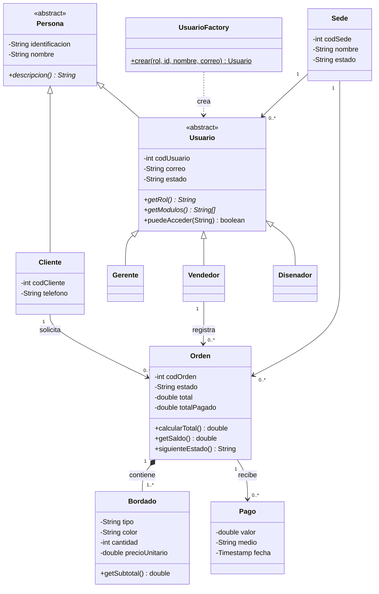

# Diagramas de referencia

## Diagrama de clases del modelo (herencia y relaciones)

```mermaid
classDiagram
direction TB
class Persona {
  <<abstract>>
  -String identificacion
  -String nombre
  +descripcion()* String
}
class Cliente {
  -int codCliente
  -String telefono
}
class Usuario {
  <<abstract>>
  -int codUsuario
  -String correo
  -String estado
  +getRol()* String
  +getModulos()* String[]
  +puedeAcceder(String) boolean
}
class Gerente
class Vendedor
class Disenador
class UsuarioFactory {
  +crear(rol, id, nombre, correo)$ Usuario
}
class Sede {
  -int codSede
  -String nombre
  -String estado
}
class Orden {
  -int codOrden
  -String estado
  -double total
  -double totalPagado
  +calcularTotal() double
  +getSaldo() double
  +siguienteEstado() String
}
class Bordado {
  -String tipo
  -String color
  -int cantidad
  -double precioUnitario
  +getSubtotal() double
}
class Pago {
  -double valor
  -String medio
  -Timestamp fecha
}
Persona <|-- Cliente
Persona <|-- Usuario
Usuario <|-- Gerente
Usuario <|-- Vendedor
Usuario <|-- Disenador
UsuarioFactory ..> Usuario : crea
Cliente "1" --> "0..*" Orden : solicita
Vendedor "1" --> "0..*" Orden : registra
Orden "1" *-- "1..*" Bordado : contiene
Orden "1" --> "0..*" Pago : recibe
Sede "1" --> "0..*" Orden
Sede "1" --> "0..*" Usuario
```

> La jerarquía de la vista (`PanelBase`, `PanelListaOrdenes` y sus hijas) está en `docs/uml-vista.png`.
