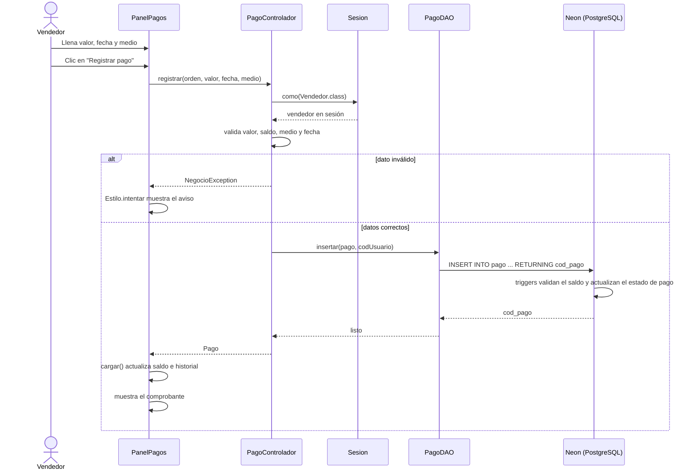

# Diagramas de referencia

## Flujo de usuario: registrar un pago

```mermaid
sequenceDiagram
    actor U as Vendedor
    participant V as PanelPagos
    participant C as PagoControlador
    participant S as Sesion
    participant D as PagoDAO
    participant B as Neon (PostgreSQL)
    U->>V: Llena valor, fecha y medio
    U->>V: Clic en "Registrar pago"
    V->>C: registrar(orden, valor, fecha, medio)
    C->>S: como(Vendedor.class)
    S-->>C: vendedor en sesión
    C->>C: valida valor, saldo, medio y fecha
    alt dato inválido
        C-->>V: NegocioException
        V->>V: Estilo.intentar muestra el aviso
    else datos correctos
        C->>D: insertar(pago, codUsuario)
        D->>B: INSERT INTO pago ... RETURNING cod_pago
        B->>B: triggers validan el saldo y actualizan el estado de pago
        B-->>D: cod_pago
        D-->>C: listo
        C-->>V: Pago
        V->>V: cargar() actualiza saldo e historial
        V->>V: muestra el comprobante
    end
```
